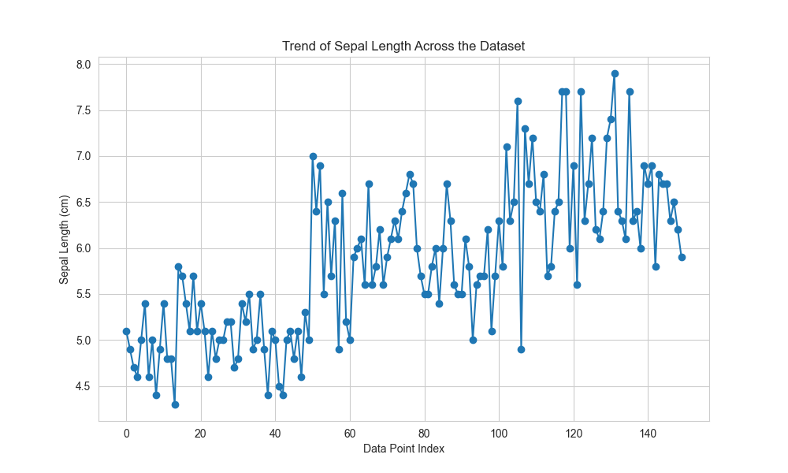

# Python Data Analysis with Pandas and Matplotlib

This repository contains a Python script for analyzing the Iris dataset using the `pandas` library and creating visualizations with `matplotlib` and `seaborn`. The script covers data loading, exploration, basic analysis, and the creation of four different types of plots.

This script is part of the `Python-PowerLearnProject`.

---

## Features

- **Data Loading**: Loads the Iris dataset from a URL.
- **Data Exploration**: Displays the first few rows, checks the data structure, and looks for missing values.
- **Basic Analysis**: Computes summary statistics and groups data by species to find mean values.
- **Data Visualization**: Generates and saves four plots:
  - A line chart showing the trend of sepal length.
  - A bar chart comparing the average petal length across species.
  - A histogram showing the distribution of sepal width.
  - A scatter plot illustrating the relationship between sepal length and petal length.

---

## Program Code

The script is located at `data-analysis-wk6/data_analysis.py`.

---

## Visualizations

The script generates the following plots:

**1. Trend of Sepal Length**



**2. Average Petal Length by Species**


**3. Distribution of Sepal Width**


**4. Sepal Length vs. Petal Length**


---

## Usage

Navigate to the project directory and run the script with Python 3. Ensure you have `pandas`, `matplotlib`, and `seaborn` installed.

```bash
pip install pandas matplotlib seaborn
python data-analysis-wk6/data_analysis.py
```

---

## Requirements

- Python 3.x
- Pandas
- Matplotlib
- Seaborn

---

## Clone The Project Repository

To get a local copy of the project, clone the `Python-PowerLearnProject` repository:

```bash
git clone https://github.com/damilareadekeye/Python-PowerLearnProject.git
cd Python-PowerLearnProject
```

---

## Author

**Damilare Lekan Adekeye**  
Portfolio: https://damilareadekeye.com
